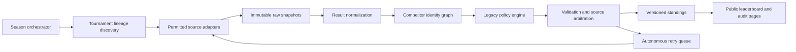

# Autonomous National Points Race — Design Specification

**Status:** Approved design, awaiting written-spec review

**Date:** 2026-08-11

**Policy baseline:** Extemp Central 2024–2025 National Points Race

**Selected approach:** Frozen legacy policy with autonomous tournament-lineage discovery

## 1. Purpose

Build a public successor to the discontinued Extemp Central National Points Race that operates every season without routine human input. The system will discover annual editions of the final official tournament roster, collect permitted official results, reproduce the legacy scoring rules and precedents, resolve competitors across sources, recalculate standings after corrections, and publish an auditable leaderboard.

The system preserves the last authoritative competition. It does not invent new tournaments, rebalance regions, or let an AI decide prestige. Those actions would create a different competition and would make zero-touch governance irreconcilable with faithful continuity.

## 2. Meaning of “100% autonomous”

After initial deployment and any one-time source permissions, the service requires no routine scheduling, uploads, tier decisions, result entry, identity cleanup, season rollover, or restart by the owner.

Autonomy is distinct from external-data availability. No system can force a tournament to publish results or prevent a provider from changing or removing access. Therefore correctness has priority over apparent completeness:

- The service never fabricates a placement, identity match, tournament edition, or policy.
- When official evidence is unavailable or contradictory, the service publishes an explicit `awaiting official results` or `source unavailable` state and keeps retrying permitted sources.
- A result becomes final only after validation and a stability window.
- Later official corrections automatically supersede earlier snapshots and trigger full recalculation.

This behavior is still zero-touch: unresolved evidence is handled by retry, alternative-source arbitration, or a visible unavailable state, not by requiring the owner to intervene.

## 3. Chosen and rejected approaches

### 3.1 Chosen: frozen legacy competition

Freeze the 2024–2025 tournament roster, tier assignments, point tables, exceptions, bonus calculation, and season tiebreakers. Discover later editions by lineage. If a tournament is canceled, it awards no points. A renamed edition is followed only when deterministic lineage evidence establishes continuity. Entirely new tournaments are not added.

This is the only approach that combines faithful continuity, auditability, and zero routine governance.

### 3.2 Rejected: quantitatively adaptive tiers

An algorithm could rank tournaments using field size, strength, geography, and three-year history. This would be autonomous, but it would not reproduce the discontinued competition: the original tier process contained human judgments about prestige, calendar balance, and regional opportunity. It would also introduce gaming incentives and require new policy choices.

### 3.3 Rejected: AI adjudication

An AI could read invitations and results and decide whether a tournament or edge case “looks equivalent.” This is flexible but nondeterministic, difficult to test, and inappropriate for awarding public competitive points. AI may assist document extraction, but it never has authority to assign points, merge identities, select tournaments, or change policy.

## 4. Frozen tournament roster and points

The permanent roster is the final published 2024–2025 structure.

### Tier 1

- NSDA National Tournament

| Finish                   | Base points | Strong-field points |
| ------------------------ | ----------: | ------------------: |
| 1st                      |         200 |                 250 |
| 2nd                      |         170 |                 213 |
| 3rd                      |         140 |                 175 |
| 4th                      |         100 |                 125 |
| 5th                      |          80 |                 100 |
| 6th                      |          66 |                  83 |
| 7th                      |          50 |                  63 |
| 8th                      |          48 |                  60 |
| 9th                      |          46 |                  58 |
| 10th                     |          44 |                  55 |
| 11th                     |          40 |                  50 |
| 12th                     |          38 |                  48 |
| 13th                     |          36 |                  45 |
| 14th                     |          34 |                  43 |
| Quarterfinalist          |          30 |                  38 |
| Octafinalist             |          10 |                  13 |
| Final-round winner bonus |          40 |                  50 |

The strong-field values are the base values multiplied by 1.25 and rounded to the nearest integer with `.5` rounded upward.

### Tier 2

- Montgomery Bell Academy Extemp Round Robin
- Harvard National Speech and Debate Tournament
- NCFL Grand National Tournament

| Finish          | Points |
| --------------- | -----: |
| 1st             |    150 |
| 2nd             |    120 |
| 3rd             |    105 |
| 4th             |     75 |
| 5th             |     60 |
| 6th             |     50 |
| Semifinalist    |     38 |
| Quarterfinalist |     23 |
| Octafinalist    |      8 |

MBA is an exception: places 1–6 receive points, but only places 1–5 receive the finals tiebreak flag, following the Exhibition Round precedent.

### Tier 3

- Glenbrooks
- University of Texas Longhorn Classic
- California Invitational
- University of Kentucky Tournament of Champions

| Finish          | Points |
| --------------- | -----: |
| 1st             |    100 |
| 2nd             |     85 |
| 3rd             |     70 |
| 4th             |     50 |
| 5th             |     40 |
| 6th             |     33 |
| Semifinalist    |     25 |
| Quarterfinalist |     15 |

### Tier 4

- Yale Invitational
- Florida Blue Key
- Princeton Classic
- Barkley Forum
- Stanford National Invitational
- Tournament of Champions of Extemporaneous Speaking
- National Individual Events Tournament of Champions

| Finish       | Points |
| ------------ | -----: |
| 1st          |     70 |
| 2nd          |     60 |
| 3rd          |     49 |
| 4th          |     35 |
| 5th          |     28 |
| 6th          |     23 |
| Semifinalist |     18 |

### Tier 5

- National Speech and Debate Season Opener at the University of Kentucky
- New York City Invitational
- George Mason Patriot Games
- James Logan MLK Invitational
- Apple Valley Minneapple Speech Tournament

| Finish | Points |
| ------ | -----: |
| 1st    |     40 |
| 2nd    |     34 |
| 3rd    |     28 |
| 4th    |     20 |
| 5th    |     16 |
| 6th    |     13 |

## 5. Executable policy ledger

The ledger is versioned as `legacy-2024-25-v1`. Scoring code consumes it as data rather than embedding values in collection logic.

### 5.1 Eligible events

- Score only the tournament’s open or varsity high-school extemporaneous-speaking competition.
- Eligible labels include combined Extemp and separate International Extemp/Foreign Extemp and United States Extemp/Domestic Extemp divisions.
- Novice, junior-varsity, middle-school, college, asynchronous practice, and non-extemp events are ineligible.
- When a competitor enters more than one eligible extemp division at the same tournament, only that competitor’s highest single point award counts. Wins, top-three finishes, and finals also count at most once for that tournament and derive from the selected result.

### 5.2 Final placement and oversized finals

- Places 1–6 receive the tier’s placement points.
- A final participant placed seventh or lower does not receive finalist points.
- That participant receives the preceding elimination bucket when the tier awards that bucket. For example, seventh place at a Tier 3 event receives the Tier 3 semifinalist award of 25 points.
- If the tier has no preceding elimination bucket, the participant receives zero. Therefore seventh place at a Tier 5 event receives zero.
- The `finals` season statistic counts scored places 1–6, except at MBA where only places 1–5 receive finals credit under the Exhibition Round precedent.
- The service accepts the tournament’s officially published placement and tiebreaker. It does not recompute judge-preference or cumulative-rank tiebreakers.

### 5.3 Elimination-round classification

Round labels are normalized to a bracket depth:

- `octafinal`, `octo`, `round of 16`, and `top 16` → octafinalist
- `quarterfinal`, `quarter`, `round of 8`, and `top 8` → quarterfinalist
- `semifinal`, `semi`, `round before final`, and an officially labeled non-advancing semifinal group → semifinalist
- `final`, `exhibition`, or equivalent last competitive round → final participant

Published advancement topology overrides names when a tournament uses a nonstandard label. A competitor receives the award for the furthest eligible stage reached, subject to the oversized-final rule. Merely being registered, paired, or invited does not establish completion of a stage.

### 5.4 NSDA National Tournament

- International Extemp and United States Extemp are separate eligible divisions.
- Immediately after NCFL results become final, snapshot the season’s top 25 by points and the complete season tiebreak order.
- Count how many of those 25 are official entrants in each NSDA extemp division.
- If one division contains more, every point value and the final-round-winner bonus in that division receives the 1.25 multiplier with half-up rounding.
- If the counts are equal, neither division receives the multiplier.
- Award official placements 1–14, then quarterfinalist and octafinalist buckets from official results.
- Separately award the final-round-winner bonus using the tournament’s published final-round winner, even if that competitor is not the overall champion.
- Apply the per-tournament maximum rule only if an anomalous future format permits the same competitor in both divisions.

### 5.5 Season standings and ties

Rank competitors by:

1. Total points
2. Number of scored tournament wins
3. Number of scored top-three finishes
4. Number of scored places 1–6
5. Co-champion status if all four remain equal

The public leaderboard may display numeric ranks through the full field. Equal records after the final criterion share the same rank.

### 5.6 Tournament continuity

- Each roster member has a permanent `tournament_lineage_id`, historical aliases, organizer/host fingerprints, normal date window, locations, known platform identifiers, and eligible event patterns.
- Stable platform lineage signals—such as a Tabroom webname and its Past Years chain—have highest priority.
- A renamed candidate is accepted only when the lineage score passes a strict threshold and contains no hard contradiction. Required evidence includes a stable edition chain or organizer/host continuity plus date-window and event-structure agreement.
- A candidate with a conflicting organizer, overlapping independent edition, or substantially different event purpose is rejected.
- If no valid edition is found after the lineage’s normal date window plus 30 days, mark it `not held or no official edition found`; award no points and continue discovery in case evidence appears later.
- New tournaments are never added and existing lineages are never moved between tiers automatically.

## 6. System architecture

### 6.1 Season orchestrator

- Creates the new season automatically on August 1 using the ending calendar year as the season identifier.
- Runs lineage discovery weekly before an event and daily inside its expected date window.
- Begins result checks after the detected tournament end time.
- Rechecks active results with exponential backoff, then daily for seven days and weekly until season closure.
- Closes the season after NSDA results have been stable for seven days, while retaining a low-frequency correction check.
- Creates the next season without copying transient source IDs; it reuses permanent lineages and policy version.

All jobs are idempotent and protected by per-tournament leases so retries cannot double-award points.

### 6.2 Source adapters and precedence

The system uses only permitted public or explicitly authorized access. It does not bypass authentication, anti-bot controls, robots policies, or terms of use.

Source precedence:

1. Official structured tournament export
2. Official organizer-published CSV, spreadsheet, or results packet
3. Official tournament results page accessed under its permitted terms
4. An explicitly authorized provider feed

Tabroom’s officially described public tournament JSON export is the preferred Tabroom source. Requests are made by exact tournament ID, only after the event, with bounded retries and identifiable low-frequency traffic. Large tournament exports are never polled continuously.

SpeechWire’s current terms prohibit scraping and automated extraction without prior written permission. A SpeechWire adapter remains disabled until authorization exists. In its absence, the system uses independent official result packets published by the tournament or governing organization. If neither exists, the tournament remains visibly unavailable rather than being scraped unlawfully.

Every fetch records URL, source type, retrieval time, response hash, parser version, and permission classification. Raw snapshots are immutable so any award can be reproduced later.

### 6.3 Normalization

Adapters produce one canonical result schema containing:

- tournament lineage and edition
- source and snapshot hash
- event and division
- source-specific school, entry, and student identifiers
- published competitor name and school
- completed rounds and advancement
- official overall placement
- official final-round winner when applicable
- publication/finality indicators

Parsers preserve the original values beside normalized values. Document extraction may use deterministic table parsers and bounded AI assistance, but validation must prove that every emitted record corresponds to visible source evidence. AI output alone is never a scoring source.

### 6.4 Competitor identity graph

The public canonical profile stores only the competitor’s published name, school history, source IDs, results, and provenance. Emails, phone numbers, contact IDs, ballots, judge comments, and unrelated registration metadata are discarded.

Identity matching priority:

1. Same stable source-specific student identifier
2. Existing cross-source mapping supported by exact normalized name and school
3. Exact normalized name plus canonical school and compatible season history
4. High-confidence multi-signal match using name similarity, school aliases, geography, event timing, and one-to-one constraints

Low-confidence candidates are not merged. They remain separate until later evidence makes a deterministic merge possible; the resolver retries automatically after every new tournament. Merges are versioned and trigger complete recalculation. A source-specific ID can map to only one canonical competitor, and a canonical competitor cannot have impossible simultaneous entries.

### 6.5 Policy engine

The policy engine is a pure deterministic function of:

- the versioned policy ledger
- normalized official results
- the versioned identity graph
- the NCFL top-25 snapshot for NSDA bonus calculation

It emits award records rather than directly mutating totals. Each award includes the rule ID, input result, source snapshot, points, and derived win/top-three/final flags. Standings are a reproducible aggregation of these awards.

### 6.6 Source arbitration and finality

- A candidate result must satisfy tournament identity, eligible-event, bracket-consistency, and competitor-reference checks.
- Two official sources that agree reinforce finality. When they conflict, the higher-precedence and more recently corrected official source wins only if it explicitly represents the same edition and event.
- A result may be published as provisional after a complete official result set appears.
- It becomes final after two identical permitted checks separated by at least six hours and at least twelve hours after tournament end, or immediately when an official source explicitly marks it final.
- Corrections create new award and standings versions; previous versions remain available in the audit history.
- Failed or contradictory validation never silently drops a previously final award. The public edition status explains that a correction is being verified until a valid successor is available.

## 7. Data model

Core entities:

- `PolicyVersion`
- `TournamentLineage`
- `TournamentEdition`
- `SourceSnapshot`
- `NormalizedEvent`
- `NormalizedResult`
- `SourcePerson`
- `CanonicalCompetitor`
- `IdentityEdge`
- `Award`
- `StandingsVersion`
- `JobRun`

Uniqueness constraints prevent duplicate editions, duplicate result ingestion, duplicate awards for the same competitor/tournament, and multiple active mappings for a source person. Content hashes make ingestion idempotent.

## 8. Public product

The public site provides:

- current season leaderboard
- points, wins, top-three finishes, and finals
- per-competitor tournament breakdown
- per-tournament scored results
- tournament status: upcoming, awaiting results, provisional, final, corrected, not held, or source unavailable
- source and rule provenance for every award
- policy and tournament-roster pages
- archived season standings
- correction history and standings-version timestamps
- machine-readable JSON and CSV exports of the derived leaderboard

The product must clearly identify itself as a community successor based on Extemp Central’s final published rules, not as Extemp Central or an official endorsement by any tournament platform.

## 9. Reliability, safety, and operations

- Use managed scheduled compute, a transactional relational database, immutable object storage, and a statically cacheable public frontend.
- Maintain separate collection, normalization, identity, scoring, and publishing stages so a parser failure cannot corrupt standings.
- Validate source URLs against configured provider allowlists to prevent server-side request forgery.
- Set strict response-size, MIME-type, redirect, and execution-time limits.
- Never execute scripts, macros, formulas, or embedded instructions from fetched documents.
- Store secrets only in the deployment platform’s secret manager; never in source control or policy files.
- Back up the database and raw-source index automatically and test restoration on a schedule.
- Emit metrics for overdue editions, parser failures, changed schemas, identity ambiguity, result instability, and standings publication.
- Alerting may notify maintainers, but operation and safe failure do not depend on a response.

The preferred deployment target will use Cloudflare’s scheduled/serverless and hosting primitives in accordance with the project’s deployment preference; exact products and limits will be selected in the implementation plan.

## 10. Verification strategy

### 10.1 Golden-master replay

Before production, ingest the complete 2024–2025 season and reproduce the authoritative final spreadsheet exactly for every competitor:

- total points
- tournament-by-tournament points
- wins
- top-three finishes
- top-six finals
- final rank and tiebreak order

Any unexplained mismatch blocks deployment.

### 10.2 Historical precedent fixtures

Permanent tests cover:

- seventh place at the 2023 California Invitational receiving Tier 3 semifinalist points
- seventh place at the James Logan MLK Invitational receiving zero under Tier 5
- a competitor winning both IX and USX at one tournament receiving only the single highest award
- MBA places 1–6 receiving points while only places 1–5 receive the finals tiebreak flag
- NSDA strong-field counting, half-up multiplier rounding, and separate final-round bonus
- season tiebreaks and co-champion fallback
- official result correction causing idempotent recalculation

### 10.3 Contract and resilience tests

- Recorded provider fixtures for every source format
- Schema-change detection
- Oversized and incomplete brackets
- Withdrawals, ties, duplicate names, school aliases, and school transfers
- Repeated fetch and job retries producing no duplicate awards
- Source conflict and correction precedence
- Missing source yielding an explicit unavailable state rather than points
- Full season rollover with no owner action

## 11. Acceptance criteria

The implementation is ready to launch only when:

1. The 2024–2025 golden-master replay is exact.
2. All frozen tiers, point tables, and precedents are represented by named policy rules and tests.
3. Every point award is traceable to an immutable official-source snapshot and rule ID.
4. A complete simulated season, including corrections and rollover, runs without human input.
5. Repeated ingestion and scoring are idempotent.
6. The service does not use prohibited scraping or bypass access controls.
7. No nonessential personal information is retained or published.
8. Missing or ambiguous evidence produces a truthful visible state, never an inferred award.
9. Renamed editions require deterministic lineage evidence; new tournaments cannot enter the roster automatically.
10. Deployment, backups, monitoring, and recovery are automated.

## 12. Authoritative references

- Extemp Central, 2024–2025 structure and point tables: <https://extemp.com/2024-2025-extemp-central-national-points-race-the-structure-of-this-years-competition/>
- Extemp Central, final 2024–2025 standings: <https://extemp.com/natl-points-race/>
- Authoritative 2024–2025 spreadsheet: <https://docs.google.com/spreadsheets/d/1zKg4DMD9OwQaBFVPBPRIkgsTueH86TQV/edit?gid=508191381>
- MBA Exhibition Round finals-credit precedent: <https://extemp.com/2024-montgomery-bell-academy-extemp-round-robin/>
- 2025 MBA sixth-place points confirmation: <https://extemp.com/2025-montgomery-bell-academy-extemp-round-robin-haider-wins-convincing-victory-over-star-studded-field/>
- Oversized Tier 3 final precedent: <https://extemp.com/2023-california-invitational-vakkalagadda-notches-another-win-for-bellarmine-college-preparatory-trivedi-takes-second-after-winning-final-round/>
- Oversized Tier 5 final and multi-division precedent: <https://extemp.com/2023-james-logan-mlk-invitational-gercken-sweeps-ix-olakangils-title-defense-in-ix-falls-short/>
- Season tiebreak precedent: <https://extemp.com/2014-2015-national-points-race-how-fridays-finals-will-determine-this-years-winner/>
- Tabroom public-data guidance: <https://www.tabroom.com/index/help.mhtml>
- Tabroom public-results documentation: <https://docs.tabroom.com/Public_Results>
- SpeechWire terms of use: <https://www.speechwire.com/p-terms-of-use.php>
